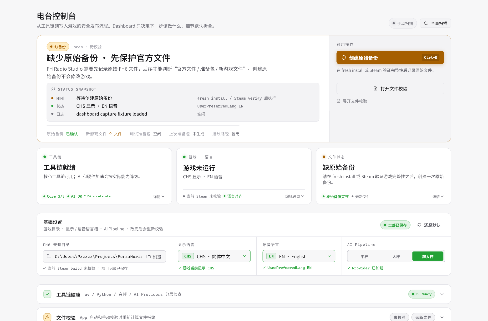

# FH Radio Studio 初次使用指南：从创建项目到写入游戏

如果只是想听自己的歌，后台开播放器就够了。FH Radio Studio 解决的是另一件事：把自选音乐接进 Forza Horizon 的游戏内电台，让它参与比赛开始、冲线、漫游循环、曲目信息和游戏混音，而不是只作为游戏外的背景声。

另一个 FH Radio Studio 想要解决的痛点是，如何管理游戏文件、如何用 ui 实现这个功能，以及，用 AI 辅助完成比赛开始、冲线、循环这些时间点的选择。

FH Radio Studio 修改的是本机 PC 版游戏文件。请先确认你理解这件事：写入前一定要关闭游戏，初次使用时一定要创建原始备份。工具会尽量把风险摊开给你看，但你仍然应该保留自己的外部备份。

## 你需要准备什么

开始前，先准备好这些东西：

- Windows 桌面环境。
- 已安装的 Forza Horizon 6 PC 版。
- 想导入的音频文件，例如 `.mp3`、`.flac`、`.wav`。
- 足够的磁盘空间，用来存放项目、分析缓存、准备包和备份。

FH Radio Studio 会打包一个基础 AI 分析能力，所以初次使用也可以直接生成基础候选。只有当你想启用更完整的本地分析档位时，才需要同步额外的 AI 环境和模型缓存；首次同步可能会比较慢。

## 第一步：创建项目目录

打开 FH Radio Studio 后，先创建或打开一个项目目录。

推荐使用默认位置：

```text
<你的用户目录>/FH Radio Studio/
```

项目目录会保存这次电台修改所需的全部工作文件，包括：

- `sources/`：本地导入的音乐。
- `siren/`：从 MONSTER SIREN 塞壬唱片导入的歌曲和记录。
- `packages/`：生成出来、等待写入的准备包。
- `backups/`：原始游戏文件备份和更新验证记录。
- `analysis/`：波形、AI、响度、timing 等分析缓存。
- `.fh-radio-studio/`：项目设置、播放列表草稿、歌曲 metadata 和写入记录。

把项目看成一个工作区会更容易理解：你之后导入、分析、确认、生成准备包，都会围绕这个目录进行。

## 第二步：设置 FH6 安装目录

进入项目后，先设置 FH6 的安装目录。

Steam 版常见路径类似：

```text
C:\Program Files (x86)\Steam\steamapps\common\ForzaHorizon6
```

如果你不确定游戏装在哪里，可以在 Steam 里打开游戏属性，找到“已安装文件”，再进入本地文件位置。

设置完成后，FH Radio Studio 会检查游戏目录是否包含它需要识别的电台文件和资源。只有目录检查通过后，后面的备份、准备包和写入流程才有意义。



_这里对应 18 case 里的 `01-no-baseline` 状态：游戏目录和语言槽已识别，下一步是创建原始备份。_

## 第三步：创建原始备份

首次修改前，请先到文件校验或备份相关页面，点击“创建原始备份”。

这一步非常重要。它会记录当前可信的 FH6 文件状态，后面写入游戏前也会用这个 baseline 判断文件是否仍然安全。

不要跳过这一步。没有可信 baseline 时，工具无法判断：

- 当前文件是不是原版文件。
- 当前文件是不是上一次由 FH Radio Studio 写入的结果。
- 当前文件是不是被游戏更新或其他工具改过。

如果 Steam 更新了游戏，FH Radio Studio 可能会提示当前文件和已有 baseline 不一致。这时不要急着覆盖，先走工具提供的 pending verification 流程：保存新文件记录，生成测试准备包，进游戏确认后再提升为新的当前 baseline。

## 第四步：导入歌曲

你有两种导入方式。

第一种是导入本地音频。把 `.mp3`、`.flac`、`.wav` 文件加入项目后，它们会进入 `sources/`，并出现在自建歌曲池里。

第二种是从 **MONSTER SIREN 塞壬唱片**导入。你可以在 App 里浏览专辑和歌曲，试听后加入导入队列，再一键导入到当前项目。塞壬歌曲会进入 `siren/`，并保留歌曲名、艺术家、专辑、封面和来源标识。

导入完成后，歌曲会统一出现在歌曲池里。无论它来自本地文件还是塞壬唱片，后续都可以走同一套流程：分配到电台、分析时间点、生成准备包、写入游戏。

## 第五步：分配到电台和播放列表

打开播放列表编辑器，把歌曲分配到目标电台。

FH6 的电台结构有一些限制，所以这里不要把它理解成普通播放器的歌单编辑器。你需要特别注意：

- 你可以把自定义歌曲拖入 built-in 原版电台。
- 只要向 built-in 电台拖入自定义歌曲，这个电台就会切换成 custom 模式。
- custom 模式不会和原曲混排；切换后该电台的原版曲目不会保留在游戏内播放列表里。

同一个电台下面会有 FreeRoam 和 Event 两套播放列表。功能上，FH Radio Studio 支持分别配置它们；理论上，同一个电台在 FreeRoam 和 Event 下可以使用完全不同的歌曲列表。

- FreeRoam 是漫游时的播放列表。
- Event 是比赛或事件场景里的播放列表。

不过这条路线目前还没有做完整实机覆盖测试。初次配置时可以先让 FreeRoam 和 Event 使用同一组歌曲，确认基础流程跑通后，再尝试把两套歌单分开，并在游戏里分别测试漫游和比赛场景。


_播放列表编辑器会显示 built-in / custom 状态，并把待分配歌曲池放在右侧。_

## 第六步：运行 AI 时间点分析

分配歌曲后，进入替换编辑器。

对每首自定义歌曲，FH Radio Studio 需要确认 6 个时间点：

- `TrackDrop`：比赛开始的播放点。
- `PostDrop`：冲线后的播放点。
- `TrackLoopStart` / `TrackLoopEnd`：比赛中的主循环段。
- `PostLoopStart` / `PostLoopEnd`：冲线后的循环段。

点击音频分析后，工具会生成波形、BPM、段落信息和 AI 候选点。基础分析随工具提供；如果你同步了额外模型，也可以选择更完整的分析档位：

- **中杯**（`local-base`）：内置基础 AI 分析，没有明显额外配置要求，适合初次使用和快速出候选；当前选点质量可能不如高杯级理想。
- **大杯**（`local-deep`）：启用更完整的本地分析 provider，和中杯的差距非常明显；建议使用 16GB 及以上显存、并支持 BF16 的 NVIDIA 显卡。
- **超大杯**（`local-heavy`）：当前 AI 选点调试和验证主要基于这个档位。它和大杯的实际结果暂时没有明显区别，但超大杯是目前更接近验收口径的选择；硬件建议同大杯。

如果只是初次熟悉流程，可以先用内置基础分析了解界面。准备认真制作一首歌、并且机器配置足够时，再同步额外模型并尝试超大杯。中杯和大杯的选点继续打磨、以及高杯级性能优化，都属于后续规划；也欢迎对性能和选点准确率感兴趣的开发者提交 PR。


_替换编辑器会把波形、时间点、循环区间、AI 分析状态和试听控制放在同一屏。_

## 第七步：试听并确认 4 组时间点

AI 会给候选，但不会替你确认。你需要逐组试听。

替换编辑器里通常会看到 4 组确认块：

- TD：TrackDrop，比赛开始的播放点。当前策略偏向歌曲前段可识别的 intro/base 起跑点，并尽量贴近下拍。
- PD：PostDrop，冲线后的播放点。当前策略偏向歌曲后半段的能量回归、chorus、bridge 或 solo 边界。
- TL：TrackLoop，比赛中的主循环段。当前策略会找小节对齐、首尾相似、段落兼容的 A/B 点。
- PL：PostLoop，冲线后的循环段。当前策略偏向更短、更稳、靠近 PD 或覆盖 chorus-like 段落的循环。

TD 和 PD 主要听“从这里切入是否自然”。TL 和 PL 更要认真听循环，因为循环点不只是位置问题，还关系到前后拼接是否突兀。

建议按这个顺序操作：

1. 先播放整首歌的一小段，熟悉大致结构。
2. 听 AI 推荐的第一个 TD 候选。
3. 如果切入太早或太晚，先试第二、第三个候选；也可以在当前候选上按 beat 或具体时间做微调。
4. 对 TL 使用“试听拼接”，确认从 loop end 回到 loop start 时是否自然。
5. 对 PD 和 PL 重复同样流程；循环点同样可以微调 start / end，而不是只能接受 AI 给出的原始值。
6. 四组都满意后，再点击确认。

如果某组显示 AI 信心不足，不代表不能用。它只是提醒你：这里一定要自己听过，不要只看排名。

## 第八步：生成准备包

所有需要写入的歌曲和播放列表都确认后，生成准备包。

准备包会写在项目目录的 `packages/` 下面。正常情况下，它只是在项目目录里生成文件，不会直接修改游戏。

这一步的意义是把“准备要写入的内容”和“真正写入游戏”分开。你可以先检查准备包是否生成成功，再进行下一步。

## 第九步：写入前检查

写入游戏前，FH Radio Studio 会进行 pre-flight 检查。

请认真看这一页。它通常会确认这些事项：

- FH6 是否已经关闭。
- 将被修改的游戏文件路径。
- 将被使用的时间点。
- 当前文件是否仍然匹配可信 baseline 或上次写入记录。
- 是否已理解这次操作会改变本地游戏文件。
- 是否已关闭游戏内电台 DJ，避免 DJ 语音干扰切歌体验。

如果检查页提示文件状态异常，不要强行继续。先回到文件校验页面，看是游戏更新、其他工具修改，还是当前项目状态和游戏目录不匹配。

## 第十步：写入游戏并测试

确认 pre-flight 后，点击写入游戏。

写入完成后，启动 FH6，进入游戏内测试：

- 目标电台是否能正常播放。
- 歌曲标题和作者是否符合预期。
- 漫游时切入是否自然。
- 比赛开始和比赛结束时的 drop 是否合适。
- loop 是否有明显断裂或重复感。

如果某首歌时间点不满意，不需要从头来过。回到 FH Radio Studio，打开替换编辑器，微调对应歌曲的 TD、PD、TL 或 PL，再重新生成准备包并写入。

## 常见问题

### 我可以只新增歌曲，不替换原曲吗？

不能按“在原版电台里额外插入一首歌，同时保留原曲”的方式新增。你可以把自定义歌曲放进 built-in 电台，但拖入后该电台会切换为 custom 模式，原版曲目不会和自定义歌曲一起保留。

### AI 结果是不是一定正确？

不是。AI 只负责提出候选。最终是否自然，必须由你试听确认。尤其是 loop，一定建议使用“试听拼接”听过再保存。

### 为什么一定要创建备份？

因为写入游戏文件有风险。备份和 baseline 可以帮助工具判断当前文件是否可信，也可以在需要时提供恢复依据。

### 游戏更新后还能直接写入吗？

不要直接写入。游戏更新可能改变原始文件。请先让工具保存 pending baseline，生成测试准备包，进游戏验证后再确认新版本。

### 我需要懂 Python 或 Flutter 吗？

普通使用不需要。App 是推荐入口。CLI 主要给开发者、调试和自动化使用。

## 初次使用建议

初次使用时，建议只改一个电台、只导入一两首歌。先熟悉创建备份、导入、分析、确认、生成准备包、写入和测试这条完整链路。

等你确认工具流程符合预期后，再开始整理更大的歌单。这样就算某个环节需要调整，也更容易定位问题。

FH Radio Studio 的目标不是把复杂流程藏在一个按钮后面，而是让你知道每一步正在发生什么。熟悉这条流程后，自定义电台就会从“改文件”变成一次可以反复打磨的音乐编辑。
