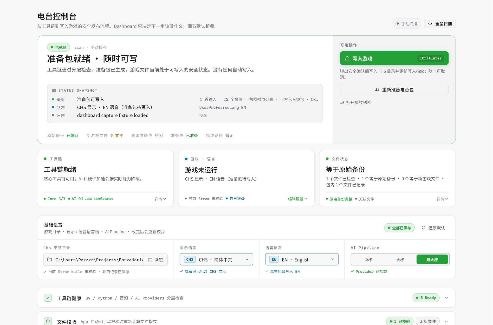
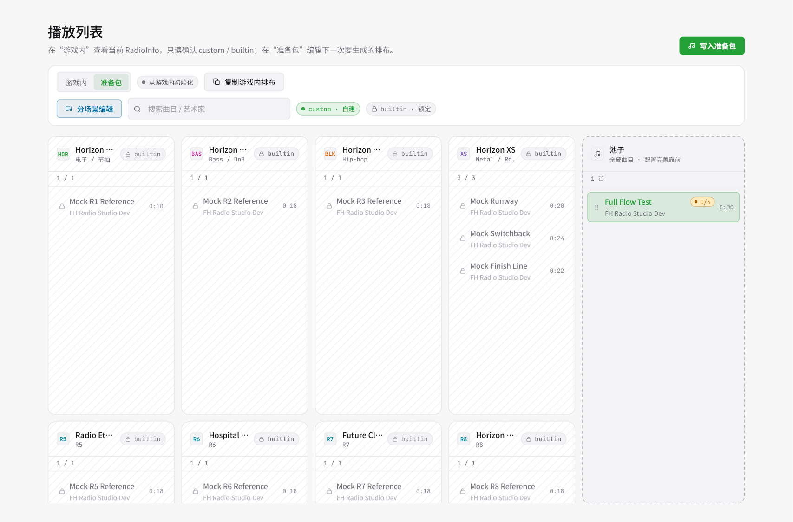
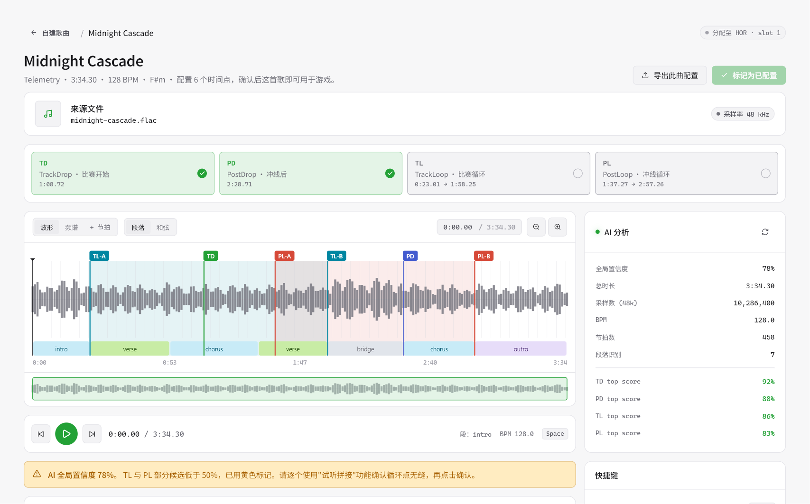

# FH Radio Studio：让自选音乐真正进入 Forza Horizon 6 电台

后台开个播放器很简单，也很够用。但它不会在起跑灯亮起时切到副歌，不会在冲线后接住结算画面，不会显示成游戏里的电台曲目，也不会跟着 Forza Horizon 的混音、循环和场景切换走。

**FH Radio Studio** 想做的是后一件事：把你选的歌接进 Forza Horizon 6 的游戏内电台，让它像原版电台曲目一样参与漫游、比赛开始、冲线、循环和曲目信息。

这也是为什么它不会是一个“选择文件，然后替换完成”的小脚本。FH6 的电台改造牵涉音频 bank、RadioInfo、播放列表、语言槽、时间点、备份，以及游戏更新后文件状态是否仍然可信。FH Radio Studio 把这些步骤收进一个桌面工作流里，让你可以导入音乐、整理歌单、用 AI 找候选时间点、生成准备包、检查游戏文件，最后再写入游戏。

> FH Radio Studio 是第三方工具，不隶属于 Playground Games、Turn 10、Xbox 或 Microsoft。它面向本地 PC 文件修改场景，使用前请自行备份并理解相关风险。

## 不只是后台播放

后台播放器的问题不在音质，而在它不知道游戏里发生了什么。自由漫游、比赛起跑、冲线、赛后循环、电台歌单和游戏混音，对它来说都只是同一个普通时间轴。

游戏内电台则不一样。一首歌要真的“进游戏”，至少要回答这些问题：

- 比赛开始时从哪里切进来？
- 冲线后接哪一段最自然？
- 漫游和赛后循环听起来会不会突兀？
- 曲名、作者和播放列表要写到哪里？
- 游戏更新覆盖文件后，还能不能安全写入？
- 改坏了或者后悔了，能不能知道该退回哪里？

这些问题手工当然能做，但很容易变成在 XML、bank 工具、音频编辑器和备份文件夹之间来回跳。FH Radio Studio 的目标不是把风险藏起来，而是把这些中间状态摆出来，让每一步都能看见、能检查、能回退。

## 一条可见的工作流

FH Radio Studio 由一个 Flutter 桌面 App 和一个 Python CLI 组成。App 负责你看到和操作的部分：项目、歌曲池、塞壬唱片导入、播放列表、替换编辑器、AI 时间点、工具链状态、文件校验和写入游戏。CLI 负责更底层的事情：扫描 FH6 文件、分析音频、生成准备包、管理 baseline、处理 package manifest 和部署。

_电台控制台会把工具链、游戏状态、文件校验、语言设置和 AI Pipeline 放在同一个状态面板里。_

一次典型修改大概是这样：

1. 创建或打开一个 FH Radio Studio 项目目录。
2. 指向本机的 FH6 安装目录。
3. 创建原始备份，让工具记住可信的游戏文件状态。
4. 导入本地 `.mp3`、`.flac`、`.wav`，或者从 **MONSTER SIREN 塞壬唱片**入口挑歌导入。
5. 在播放列表里把歌曲分配到目标电台和 FreeRoam / Event 列表。
6. 进入替换编辑器，运行音频分析，确认 TrackDrop、PostDrop、TrackLoop、PostLoop。
7. 生成准备包。
8. 写入前做 pre-flight 检查。
9. 写入游戏；必要时通过备份和记录恢复。

这里真正重要的不是步骤有多少，而是中间产物不会散落在系统各处。项目目录会保存音源、塞壬导入记录、准备包、备份、分析缓存和播放列表草稿。你可以把它当成一次电台改造的工作台。

_播放列表编辑器把 built-in / custom 电台状态、分场景歌单和待分配歌曲池放在同一张工作台上。_

## AI 负责找候选，耳朵负责拍板

电台改造里最花时间的部分，往往不是把文件放进去，而是找时间点。

对一首自定义歌曲来说，FH Radio Studio 需要确认 6 个关键点：

- `TrackDrop`：比赛开始的播放点，当前策略偏向歌曲前段可识别的 intro/base 起跑点。
- `PostDrop`：冲线后的播放点，当前策略偏向后半段的能量回归或段落边界。
- `TrackLoopStart` / `TrackLoopEnd`：比赛中的主循环段，重点看 A/B 点是否能顺畅接回。
- `PostLoopStart` / `PostLoopEnd`：冲线后的循环段，当前策略偏向更短、更稳、靠近 PostDrop 的循环。

工具会生成波形、节拍线索、段落判断、循环相似度和候选时间点。初次使用时，不需要先配置一整套大模型环境，也能跑出基础候选。

App 里会把分析分成中杯、大杯和超大杯。中杯随工具提供，没有明显额外配置要求；当前版本里，中杯和后两档的差距比较明显。大杯和超大杯的实际结果暂时没有明显区别，保留三个杯级主要是为了后续模型能力和性能优化继续分层。启用大杯或超大杯时，建议使用 16GB 及以上显存、并支持 BF16 的 NVIDIA 显卡；性能优化仍属于后续规划。

需要说明的是，目前 AI 选点调试和验证主要基于超大杯结果。中杯和大杯都可以生成候选，但选点质量可能没有超大杯稳定；把中杯、大杯也调到足够理想，是后续工作的一部分。

如果你对音频分析、模型推理、GPU/CPU 性能优化或选点准确率有兴趣，也欢迎围绕这些方向提交 PR。这里还有很多可以把工具真正变好用的工程空间。

_替换编辑器把波形、六个时间点、循环区间、AI 置信度和试听控制放在一起，方便逐组确认。_

但有一条规则不会变：**AI 不会替你确认时间点**。

循环点是否舒服，很多时候不是一个纯算法问题。某两个位置在波形上很相似，不代表听起来一定自然；候选分数很高，也不代表它适合你想要的驾驶节奏。FH Radio Studio 的设计是让 AI 先把可能的位置圈出来，再让你用波形、试听和“试听拼接”做最后判断。

## 塞壬唱片也可以直接进池子

除了本地文件导入，FH Radio Studio 也内置了 **MONSTER SIREN 塞壬唱片**入口。

你可以在 App 里浏览塞壬唱片的专辑和歌曲，试听音频，把喜欢的曲目加入导入队列，然后导入当前项目。导入后的歌曲会进入项目的 `siren/` 音源区，并保留歌曲名、艺术家、专辑、封面和来源标识。

它们不会走一套特殊流程。塞壬歌曲和本地导入的音频一样进入歌曲池，可以分配到电台、运行 AI 时间点分析、生成准备包，再走同一套写入流程。

这让“从歌库挑歌”和“把歌放进游戏”之间少了一层手动整理。

## 先生成，再写入

游戏文件写入是 FH Radio Studio 最谨慎的部分。

它采用的是先准备、再校验、最后写入的模型：

- 创建 baseline：记录可信的原始游戏文件。
- 生成 package：所有准备结果先写到项目目录，不直接碰游戏。
- 写入前校验：确认受保护文件仍然符合预期。
- pre-flight：在真正写入前展示会改哪些文件、用哪些时间点，并要求用户确认关键条件。
- 记录写入：保存 last-applied package fingerprint，便于之后判断状态。

Steam 更新或游戏文件变化时，工具不会默认把新文件当成安全目标。它会进入 pending verification 路线：保存新文件记录，生成测试准备包，让用户进游戏验证后再确认是否提升为新的当前 baseline。

这个流程看起来有点“工程化”，但它解决的是 mod 工具里最讨厌的问题：当文件状态不确定时，工具不能假装一切正常。

## 给开发者留的入口

FH Radio Studio 的桌面端使用 Flutter。核心文件处理和音频分析在 Python CLI 里完成，并且所有 Python 执行都通过 `uv` 管理。

这样拆分是为了让 App 专心做项目状态、波形编辑、播放列表和确认流程；Python 侧则处理音频分析、manifest、工具链和文件部署。CLI 也可以单独用于调试和自动化，比如检查工具链、分析音频、创建 baseline、生成准备包和部署 package。

release 包会准备离线 runtime、wheelhouse 和音频工具，尽量减少用户本机环境差异。普通用户可以只走 App，开发者和自动化场景再使用 CLI。

## 当前限制

这不是一个“无限新增电台歌曲”的工具。当前设计仍然尊重 FH6 PC 文件结构的限制：

- 面向 PC 版 FH6 文件，不支持主机端。
- 可以把自定义歌曲放入 built-in 原版电台，但拖入后该电台会切换为 custom 模式。
- custom 模式不会和原版曲目混排；切换后该电台的原曲不会保留在游戏内播放列表里。
- AI 只生成候选，最终时间点仍需要用户试听并确认。
- 不处理 DJ 语音替换；写入前也会提醒关闭游戏内电台 DJ。
- 写入游戏前必须关闭 FH6。

其中最容易误解的是“替换”的含义：把自定义歌曲拖进 built-in 电台是允许的，但它代表的是把这个电台切到 custom，而不是在原版歌单里额外插入一首歌。工具会尽量把这个模式切换放到播放列表编辑器和 pre-flight 检查里讲清楚。

## 想把它做成什么样

FH Radio Studio 最终想提供的不是炫技，而是安心感。

玩家应该能把自己的歌放进 FH6，而不必在 XML、bank、采样率、备份、游戏更新之间来回猜。开发者也应该能通过清晰的 CLI 和 JSON contract 调试整个流程，而不是靠肉眼检查一堆临时输出。

理想状态下，这个工具会像一间小工作室：

- 音源进来，有出处。
- AI 给建议，但用户拍板。
- 每次写入前，有清单。
- 每次写入后，有记录。
- 游戏更新后，有验证路线。
- 出问题时，知道该退回哪里。

这就是 FH Radio Studio 现在正在走的方向：把自定义电台从一次冒险操作，变成一条可以重复、可以检查、可以恢复的工作流。
